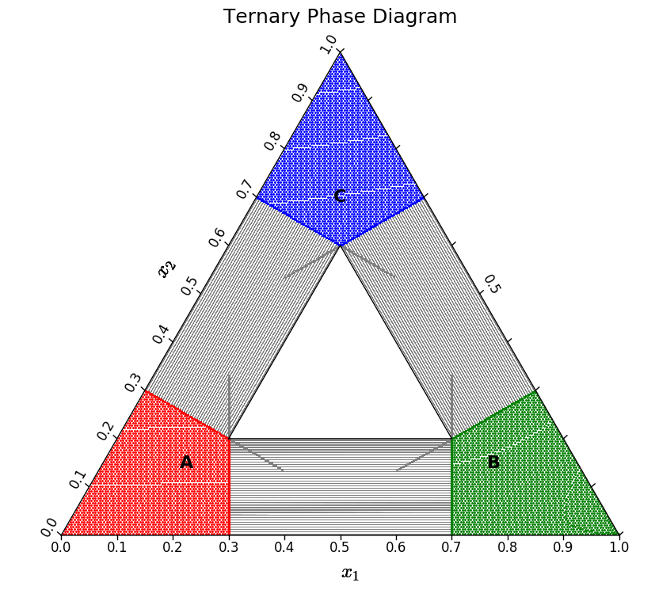

# ternary-phase-diagram

This repository presents the math and code required to construct the
thermodynamic phase diagram for a ternary alloy system containing two or three
phases.



*A ternary phase diagram, for example.*

A Makefile is provided to build both the documentation and a shared library
required to efficiently crunch the numbers. The
[derivation](ternary-diagram.tex) is written in LaTeX, while the
[implementation](phase-diagram.py) is in Python.

## Dependencies

- To use the Makefile, you will need [make](https://www.gnu.org/software/make/).
- To build the derivation, you will need a LaTeX distribution.
- To build the shared library, you will need a scientific Python distribution
  (*e.g.*, [Anaconda](https://store.continuum.io/cshop/anaconda/),
  [Canopy](https://enthought.com/products/canopy/),
  [Python(x,y)](https://python-xy.github.io/)) and
  [SymPy](https://www.sympy.org), which is available from
  [GitHub](https://github.com/sympy/sympy) or
  [PyPI](https://pypi.org/project/sympy/) (`pip install sympy`).

## Usage

With these dependencies met, you can regenerate the example phase diagram with

```bash
  $ make
```

This triggers a three-stage process:

1. Evaluate [free-energies.py](free-energies.py) to write three paraboloid
   free energies (one per phase) to C expressions:
    ```bash
    $ python free-energies.py
    ```
2. Compile the C expressions to a shared library:
    ```bash
    $ gcc -Wall -fPIC -shared paraboloids.c -o paraboloids.so
    ```
3. Execute [phase-diagram.py](phase-diagram.py) to draw the pretty picture:
    ```bash
    $ python phase-diagram.py
    ```

To rebuild the documentation, simply

```bash
  $ make docs
```

## Reuse

To make this code your own, edit [free-energies.py](free-energies.py) and refine
(or redefine) the three pure-phase free energy expressions: `GA`, `GB`, and
`GC`. Perhaps start with increasing curvatures, or change `skew` to change the
amount of "squish" along the $x_1 = x_2$ line. If you change the arguments
required to evaluate a function, you will also need to modify
[pyCinterface.py](pyCinterface.py) accordingly. When you're done, simply

```bash
  $ make
```

If things aren't making sense, it might make sense to visualize your free
energy landscape. The utility file [ternary-landscape.py](ternary-landscape.py)
will convert your free energy landscape to a grayscale contour plot. Run

```bash
  $ python ternary-landscape.py
```
